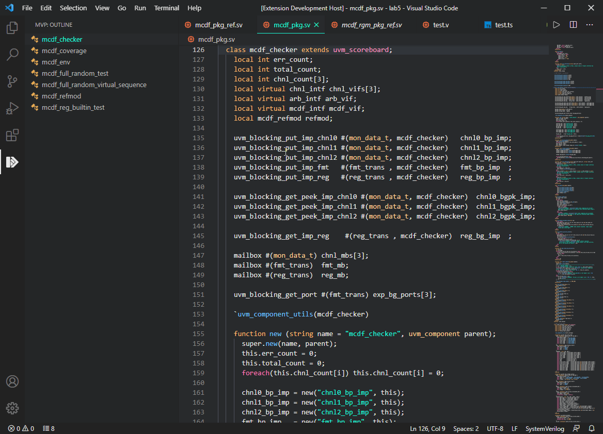

# Module_Verification_Platform

## 介绍
​	Module_Verification_Platform（简称：MVP），模块验证平台。依托于Microsoft开源代码编辑器Visual Studio Code（简称：VS Code），以VSCode插件的形式存在。主要服务于IC前端的Work-Flow。让VSCode更加接近ICer的使用场景，并带来效率和使用体验的提升。下图为MVP插件的logo。

 

## Feature

- ### 更多Feature持续开发中👌

- ### 0.5.x： Outline功能

  - #### 0.5.0：增加对SystemVerilog中class定义的识别和跳转

- ### 0.1~0.4：基础构建

## Useing

### Outline

 
