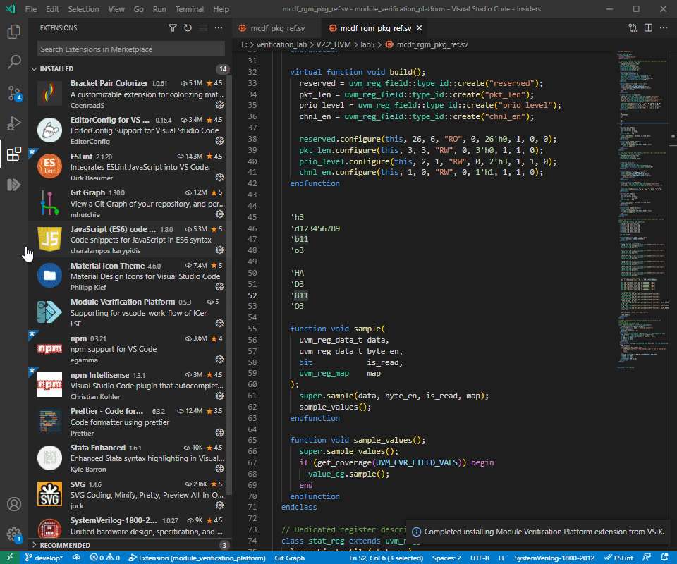
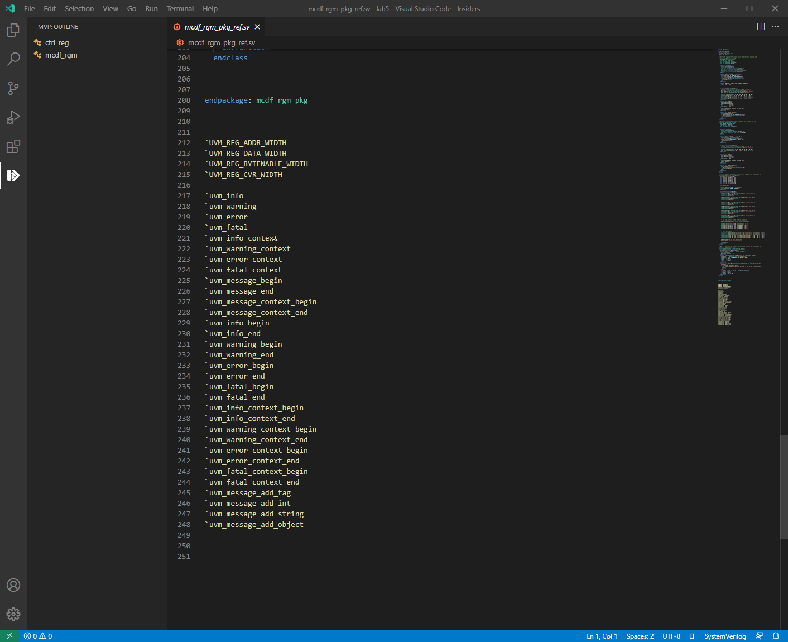
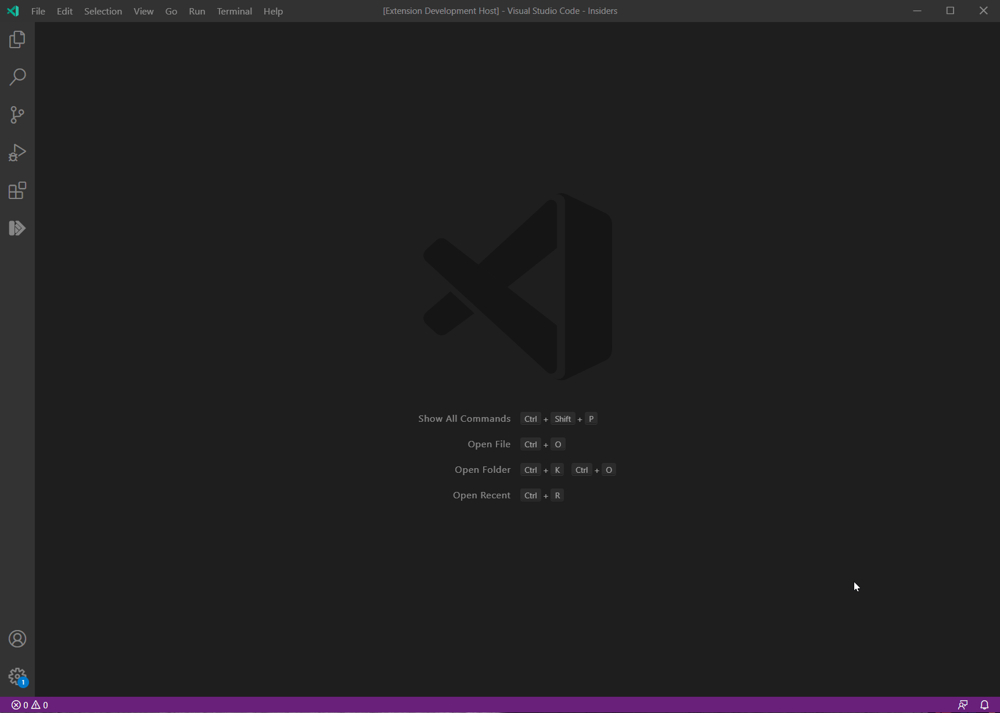

# Module_Verification_Platform

## 介绍
​	Module_Verification_Platform（简称：MVP），模块验证平台。依托于Microsoft开源代码编辑器Visual Studio Code（简称：VS Code），以VSCode插件的形式存在。主要服务于IC前端的Work-Flow。让VSCode更加接近ICer的使用场景，并带来效率和使用体验的提升。下图为MVP插件的logo。

 

## Feature

- ### 更多Feature持续开发中👌

- ### 0.5.6：增加UVM类库地图的Webview[2021-7-8]

- ### 0.5.5：uvm_reg&uvm_message相关macros悬停提示[2021-5-23]

- ### 0.5.4：uvm_seq相关macros悬停提示[2021-5-16]

- ### 0.5.3：进制自动转换功能  -> 修复二进制不能正常转换的问题  [2021-5-9]

- ### 0.5.2：进制自动转换功能  [2021-5-9]

- ### 0.5.1：增加search keys（非功能相关）[2021-5-7]

- ### 0.5.0： Outline功能  [2021-5-6]

  - #### 增加对SystemVerilog中class定义的识别和跳转

- ### 0.1~0.4：基础构建 [2021 ~ 2021-5]

## Using

### Outline

 

### Hdbo_trans：进制转换

### UVM_seq相关macros悬停提示

### UVM_reg&UVM_message相关macros悬停提示

### 呼出UVM类库地图

Ctrl+Shift+P  >> 再输入MVP WebView（如果后续增加了其他WebView功能才会单独设置呼出指令如UVM MAP等）

## Repositories

Github

https://github.com/eniacL/Module_Verification_Platform

Gitee

https://gitee.com/liang_shaofei/module_verification_platform

